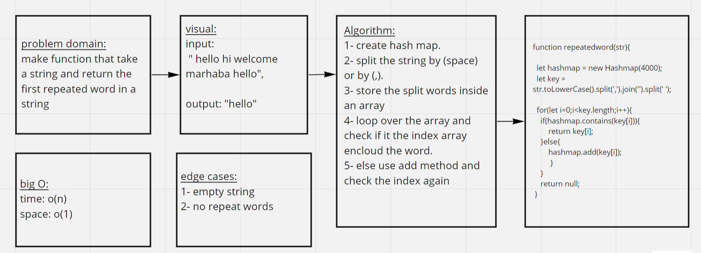

# Hash Table Implementation

Implement a HashTable and methods.

## Challenge

Implement a Hashtable Class

## Approach & Efficiency

O(1) space and time for retriving and adding

# API

**add :** Arguments: key, value and Returns: nothing.
This method should hash the key, and add the key and value pair to the table, handling collisions as needed.

**get :** Arguments: key ,Returns: Value associated with that key in the table

**contains :** Arguments: key , Returns: Boolean then indicating if the key exists in the table already.

**hash :** Arguments: key , Returns: Index in the collection for that key

**repeatedWord :** Find the first repeated word in a book.

## White Board

