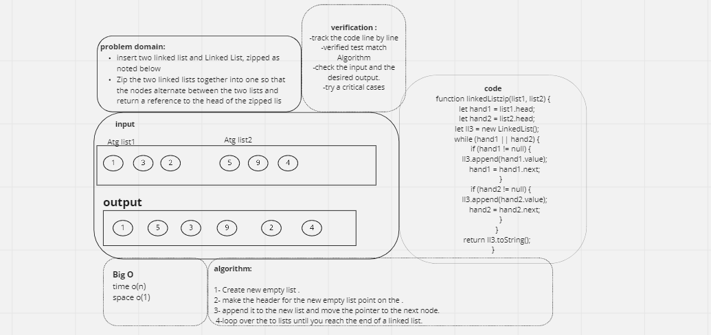

## Singly Linked List

### Challenge

We Ziped two linked lists.

### Approach & Efficiency

insertAfter(),insertBefore(),append

write the code first by whiel loop and then go and make the test

big O of time o(n)

big O of space o(1)

create linked list to return value from the end zip lists Arguments: 2 linked lists Return: Linked List, zipped as noted below

### Whiteboard Process

