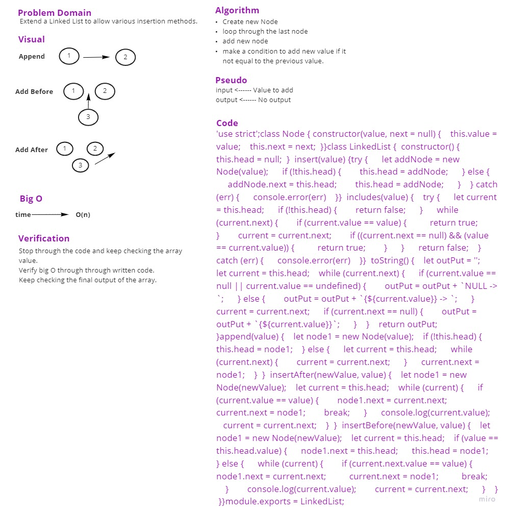

## Singly Linked List

### Challenge

Create a Node class that has properties for the value stored in the Node, and a pointer to the next Node.

Added new functions to append a new value, append before append after.

### Approach & Efficiency

write the problem domaine and the algoritheme of the code then write the code stipe by stipe and test it.

### Whiteboard Process

