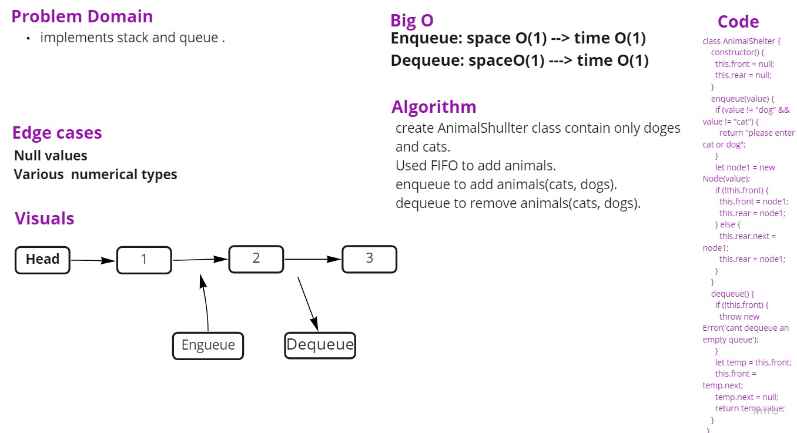

# Stacks and Queues

## Challenge

Create a Node class that has properties for the value stored in the Node, and a pointer to the next node.
Create a Stack class that has a top property. It creates an empty Stack when instantiated.

## Approach & Efficiency

##### Stacks

Push: space O(1)/time O(1)
Pop: space O(1)/time O(1)
Peek: space O(n)/time O(n)
isEmpty: space O(1)/time O(1)

#### Queues

Enqueue: space O(1)/time O(1)
Dequeue: space O(1)/time O(1)
Peek: space O(1)/time O(1)
IsEmpty: space O(1)/time O(1)

## UML Diagram

