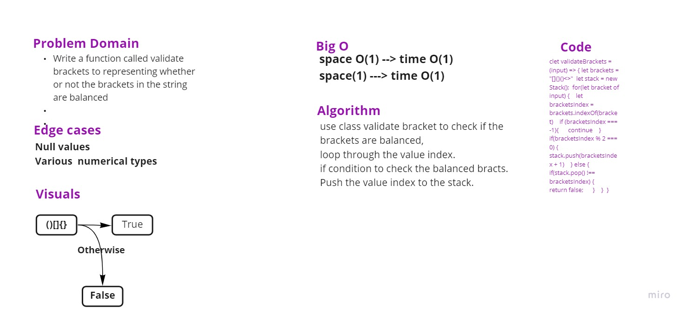

# Stacks and Queues Brackets

Write a function called validate brackets:
Arguments: string
Return: boolean
representing whether or not the brackets in the string are balanced

## Approach & Efficiency

Efficiency :bigO(n)
Approach: track the lab instructions to complete the challenge also I have used many wesites on the internet to help me solve the challenge. 
https://levelup.gitconnected.com/solving-balanced-brackets-in-javascript-with-stacks-edbc52a57309

## UML 

