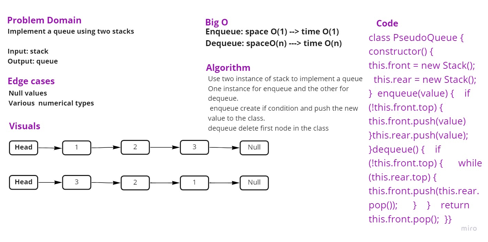

# Challenge

We have implemented a queue by using two instance of a Stack class. One of them is used for enqueue and the second one is for dequeue. Create a new PseudoQueue class. Stack instances have only push, pop, and peek methods.

## Approach & Efficiency
write the problem domaine and the algoritheme of the code then write the code stipe by stipe and test it.

## UML 

