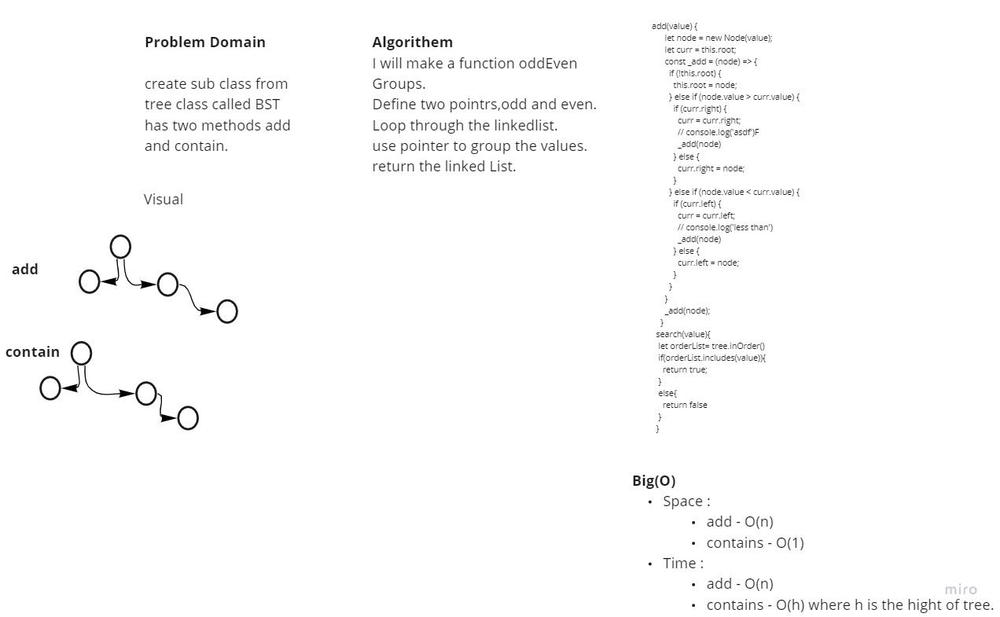

# Trees

## Challenge

Create a Node class that has properties for the value stored in the node, the left child node, and the right child node.
Create a Binary Tree class
Define a pre order method for traversing the tree.
Define a in order method for traversing the tree.
Define a post order method for traversing the tree.
Any exceptions or errors that come from your code should be semantic, capture-able errors. For example, rather than a default error thrown by your language, your code should raise/throw a custom, semantic error that describes what went wrong in calling the methods you wrote for this lab.
Create a Binary Search Tree class
Create an add method to insert in the tree in right location
Create a contains method to search for values in tree.

## Approach & Efficiency

I understood the problem first
I imagined how the results should be
I made a visual representation.
I wrote an algorithm
I wrote the code
I made the tests

## Efficiency

## Space :

add - O(n)
contains - O(1)

## Time :
add - O(n)
contains - O(h) where h is the hight of tree.

# UML

